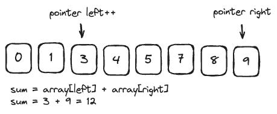

# Two Pointers

---

It's an **algorithm technique** where we use two indices that traverse a data structure (like a list, object, or string) — either **toward each other** or **in the same direction** — to solve problems more efficiently.

> **Reduces nested loops → single pass**



## When to Use Two Pointers

- **Sorted Input:** If the array or list is already sorted (or can be sorted), two pointers can efficiently find pairs or ranges.  
  *Example:* Find two numbers in a sorted array that add up to a target.  
- **Pairs or Subarrays:** When the problem asks about two elements, subarrays, or ranges instead of single elements.  
  *Example:* Longest substring without repeating characters, maximum consecutive ones, checking if a string is palindrome.  
- **Sliding Window Problems:** When you need to maintain a window of elements that grows/shrinks based on conditions.  
  *Example:* Find smallest subarray with sum ≥ K, move all zeros to end while maintaining order.  
- **Linked Lists (Slow–Fast pointers):** Detecting cycles, finding the middle node, or checking palindrome property.  
  *Example:* Floyd’s Cycle Detection Algorithm (Tortoise and Hare).

## How to Apply Two Pointers

### 1. Opposite-direction pointers

**When:** sorted array, find pairs, sums, or comparisons from both ends.

**Steps:**

1. Sort array if not sorted.  
2. Initialize `left = 0`, `right = arr.length - 1`.  
3. Loop while `left < right`:
   - Check condition (`arr[left] + arr[right] == target`).  
   - Move pointers based on condition (`left++` if sum too small, `right--` if sum too big).  

**Example:** Pair sum

```
function hasPairSum(arr, target) {
  arr.sort((a, b) => a - b);
  let left = 0,
      right = arr.length - 1;
  while (left < right) {
    let sum = arr[left] + arr[right];
    if (sum === target) return true;
    else if (sum < target) left++;
    else right--;
  }
  return false;
}

```
### 2. Same-direction (fast & slow)

**When:** remove duplicates, cycle detection, or moving elements in-place.
***Example:** Same-direction (fast & slow)
```
let slow = 0;
for (let fast = 1; fast < arr.length; fast++) {
  if (arr[fast] !== arr[slow]) {
    slow++;
    arr[slow] = arr[fast];
  }
}
```


### 3. Sliding Window (variable window)

**When:** contiguous subarray / substring problems.

**Steps:**

1. Start with left = 0, right = 0.

2. Expand right until condition fails.

3. Move left to shrink window when needed.

**Example:** Maximum sum subarray of size k
```
let sum = 0;
for (let i = 0; i < k; i++) sum += arr[i];
let max = sum;
for (let i = k; i < arr.length; i++) {
  sum += arr[i] - arr[i - k];
  max = Math.max(max, sum);
}
```
